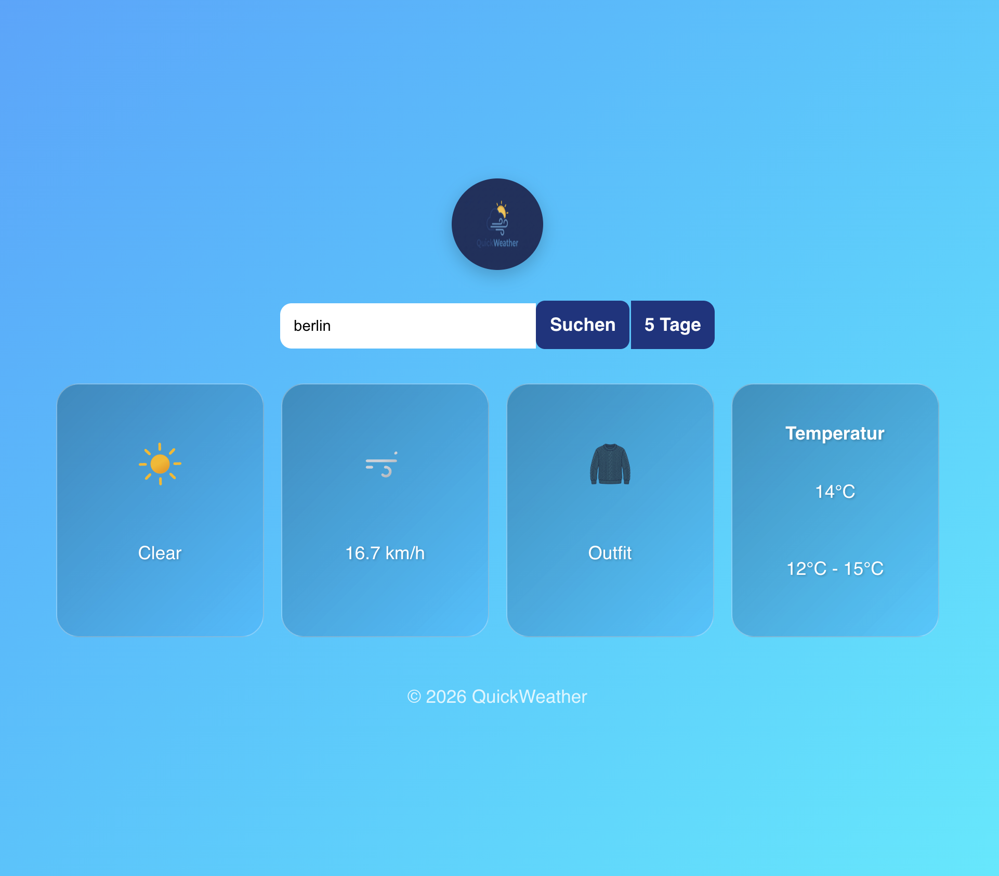

# React Weather App

Simple weather application built with React using the OpenWeather API.

## How to install

- click on "Code"
- click on "Download Zip"
- drag folder into vs code
- open new terminal
- type "npm install"
- type "npm run dev"
- copy the "Local:" adress
- paste the URL into your browser and press enter
- enjoy =)

## Features
- Search by City: Real-time data fetching from OpenWeather API
- display temperature
- display windspeed
- display weather status (like clear, cloudy etc)
- Dynamic Clothing Advice: Smart logic that recommends outfits (Shirt, Jacket, Winter Jacket)based on current temperature thresholds
- Interactive UI: Hover effects to toggle between actual temperature and "feels like" temperature
- Hidden Easter Egg: A little surprise for users who interact with the weather icons during sunny days
- Responsive Design: Tile-based layout for a modern and clean look
- weather icons

## Tech Stack
- React
- JavaScript
- OpenWeather API
- CSS (Flexbox and Animations)

## Credits
- Weather Icons: [Bas Milius Weather Icons](https://github.com/basmilius/weather-icons)
// ClothingIcons and app-logo generated by google gemini